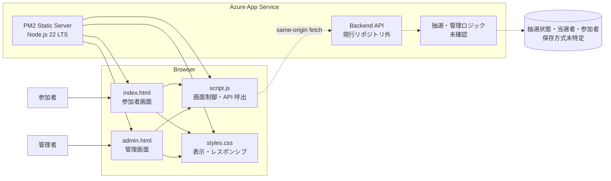
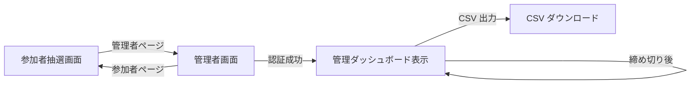

# Lucky Draw 基本設計書

## 1. 文書情報

| 項目 | 内容 |
|---|---|
| 対象システム | GitHub + Microsoft All Hands 2026 Lucky Draw |
| 対象リポジトリ | `lottery` |
| 作成基準日 | 2026-10-02 |
| 設計種別 | 現行コードのリバースエンジニアリングによる基本設計 |
| 主な根拠 | 添付構成図、`site/` の静的フロントエンド、`infra/` の Bicep 定義、`.azure/deployment-plan.md` |

## 2. 目的

本システムは、イベント参加者に 1 回の抽選体験を提供し、管理者に抽選状況の確認、イベントのリセット、抽選の締め切り、結果の CSV 出力機能を提供する。

本書では、添付構成図を論理構成の参考としつつ、現行リポジトリで確認できる実装を正として記載する。構成図に描かれているバックエンド API、抽選ロジック、永続化機構は現行リポジトリに含まれないため、「外部依存・未実装」として扱う。

## 3. 対象範囲

### 3.1 対象

- 参加者向け抽選画面
- 管理者向け管理画面
- ブラウザー上の抽選演出と API 呼び出し
- バックエンド API に期待する HTTP 契約
- Azure App Service による静的コンテンツ配信
- Bicep による Azure リソース定義

### 3.2 対象外

- `/api/draw` および `/api/admin/*` のサーバー実装
- 抽選確率、当選数制御、重複抽選防止の実装
- 参加者認証・識別方式
- 管理者認証・セッション管理のサーバー実装
- 抽選状態、当選者、参加者の永続化方式
- CSV 生成処理

## 4. システム概要

### 4.1 利用者

| 利用者 | 目的 | 主な操作 |
|---|---|---|
| 参加者 | 抽選を実行し結果を確認する | 抽選画面表示、くじを引く |
| 管理者 | イベント状態と結果を管理する | ログイン相当の認証、統計確認、リセット、締め切り、CSV 出力 |

### 4.2 主要機能

| 機能 ID | 機能 | 概要 | 現行状態 |
|---|---|---|---|
| F-01 | 抽選画面表示 | イベント名、抽選機、抽選ボタンを表示する | 実装済み |
| F-02 | 抽選演出 | API 応答待ちに表示文字を切り替え、抽選機を振動させる | 実装済み |
| F-03 | 抽選実行 | `POST /api/draw` を呼び出して結果を表示する | クライアントのみ実装済み |
| F-04 | 管理者認証 | 管理者パスワードで統計 API を呼び出し、成功時にダッシュボードを表示する | クライアントのみ実装済み |
| F-05 | 統計・結果表示 | 状態、当選者数、残り当たり数、抽選結果一覧を表示する | クライアントのみ実装済み |
| F-06 | イベントリセット | 確認後に管理 API を呼び出してイベントを初期化する | クライアントのみ実装済み |
| F-07 | 抽選締め切り | 確認後に管理 API を呼び出して抽選を締め切る | クライアントのみ実装済み |
| F-08 | CSV 出力 | 管理者認証情報付き URL から CSV をダウンロードする | リンク生成のみ実装済み |
| F-09 | Azure 配備 | Linux App Service 上で静的ファイルを配信する | IaC 実装済み |

## 5. システム構成

### 5.1 現行実装と外部依存

実線は現行リポジトリで実装済みの要素、破線は添付構成図およびクライアントコードから確認できる外部契約または未実装要素を表す。

### 5.2 配備構成

| レイヤー | リソース | 設定 |
|---|---|---|
| リソース管理 | Resource Group | `lottery`、Australia East |
| コンピュート | Linux App Service Plan | Free F1、インスタンス数 1 |
| Web ホスティング | Linux App Service | `lottery-maishid-20261002` |
| ランタイム | Node.js | 22 LTS |
| 静的配信 | PM2 | `pm2 serve /home/site/wwwroot --no-daemon` |
| 通信 | HTTPS | HTTPS 必須、HTTP/2 有効、TLS 1.2 以上 |
| ネットワーク | Public access | 有効 |
| ファイル転送 | FTPS | 無効 |

## 6. 画面設計

### 6.1 画面一覧

| 画面 ID | 画面名 | 想定 URL | 実体 | 概要 |
|---|---|---|---|---|
| SCR-01 | 参加者抽選画面 | `/` | `site/index.html` | 抽選機、抽選ボタン、結果を表示する |
| SCR-02 | 管理者画面 | `/admin` | `site/admin.html` | 管理者認証、統計、結果一覧、管理操作を提供する |

> 現行の PM2 起動コマンドには SPA フォールバックや拡張子補完の指定がない。`/admin` が `admin.html` に解決されるかは配備環境での確認またはルーティング設定が必要である。

### 6.2 画面遷移

## 7. 外部インターフェース

ブラウザーは同一オリジンの相対 URL で API を呼び出す。

| IF ID | メソッド | パス | 用途 | 認証情報 | 現行リポジトリ内の実装 |
|---|---|---|---|---|---|
| API-01 | POST | `/api/draw` | 抽選実行 | なし | 呼び出しのみ |
| API-02 | GET | `/api/admin/stats` | 管理統計取得・認証判定 | `adminKey` クエリ | 呼び出しのみ |
| API-03 | POST | `/api/admin/reset` | イベントリセット | `adminKey` クエリ | 呼び出しのみ |
| API-04 | POST | `/api/admin/close` | 抽選締め切り | `adminKey` クエリ | 呼び出しのみ |
| API-05 | GET | `/api/admin/export` | CSV 出力 | `adminKey` クエリ | URL 生成のみ |

## 8. データ設計概要

現行リポジトリにはデータベース定義やサーバー側モデルが存在しない。クライアントが参照する JSON から、次の論理データを推定する。

| 論理データ | 主な項目 | 用途 |
|---|---|---|
| 抽選結果 | `winner.prizeName` | 参加者への結果表示 |
| イベント状態 | `state.status` | 管理画面の状態表示 |
| 当たり上限 | `state.maxHits` または `state.totalHits` | 当たり総数表示 |
| 残り当たり数 | `state.remainingHits` | 残数表示 |
| 抽選履歴 | `state.winners[]` | 管理画面の結果一覧 |
| 当選者情報 | `drawNumber`, `name`, `prizeName`, `isHit` | 抽選番号、参加者名、賞品名、当落表示 |

データの保存先、キー、制約、トランザクション、保持期間は未特定である。

## 9. 非機能設計

### 9.1 ユーザビリティ・アクセシビリティ

- 参加者画面と管理画面は共通スタイルを使用する。
- 画面幅 640 px 以下ではヘッダーを縦並びにし、統計表示を 1 列にする。
- 抽選機と結果領域に `aria-live="polite"` を設定し、表示更新を支援技術へ通知する。
- API 応答待ち中は抽選演出を表示する。

### 9.2 セキュリティ

- App Service は HTTPS を必須とし、TLS 1.2 以上、FTPS 無効とする。
- 管理者パスワードは現行実装では URL クエリに含まれる。履歴・ログ・監視製品に記録される可能性があるため、本番要件としてはセッション Cookie 等への変更が必要である。
- API エラー文字列を `innerHTML` へ設定する経路があり、サーバー応答次第で DOM XSS の可能性がある。
- 「1 人 1 回」は画面表示とボタン無効化だけでは保証できないため、バックエンドで参加者識別と原子的な重複防止が必要である。
- リセットおよび締め切りにはサーバー側の認証・認可と CSRF 対策が必要である。

### 9.3 可用性・性能

- App Service Plan は Free F1、単一インスタンスであり、SLA、高可用性、自動スケールを前提としない。
- 静的ファイルは App Service から直接配信し、CDN やキャッシュ制御は現行定義に含まれない。
- 抽選 API の性能・同時実行制御はバックエンド実装不在のため未定義である。

### 9.4 運用

- インフラはサブスクリプションスコープの Bicep で作成する。
- フロントエンドは `site/` の内容を ZIP 化し、App Service へデプロイする。
- コードのロールバックは以前の ZIP パッケージの再デプロイで行う。
- インフラ削除は自動化せず、明示的な承認を必要とする。

## 10. 前提・制約・未実装事項

| 区分 | 内容 | 影響 |
|---|---|---|
| 未実装 | バックエンド API 一式がリポジトリに存在しない | 抽選・管理機能は静的配備だけでは動作しない |
| 未特定 | 永続化方式が未特定 | データ整合性、復旧、保持設計を確定できない |
| 未特定 | 参加者識別方式が未特定 | 「1 人 1 回」を保証できない |
| 制約 | 管理者認証情報を URL で送信する | 認証情報漏えいリスクがある |
| 制約 | `/admin` と `admin.html` のルーティング対応が定義されていない | 管理者画面が 404 となる可能性がある |
| 制約 | F1 の単一インスタンス | 高可用性・スケール要件に対応しない |
| 差分 | 添付図にない CSV 出力が現行画面に存在する | API-05 を追加契約として扱う |

## 11. 実装トレーサビリティ

| 設計対象 | 実装根拠 |
|---|---|
| 参加者画面 | `site/index.html` |
| 管理者画面 | `site/admin.html` |
| 画面制御・API 契約 | `site/script.js` |
| デザイン・レスポンシブ | `site/styles.css` |
| サブスクリプション・Resource Group | `infra/main.bicep` |
| App Service Plan・Web App | `infra/app-service.bicep` |
| 環境パラメーター | `infra/main.bicepparam` |
| デプロイ方針 | `.azure/deployment-plan.md` |

