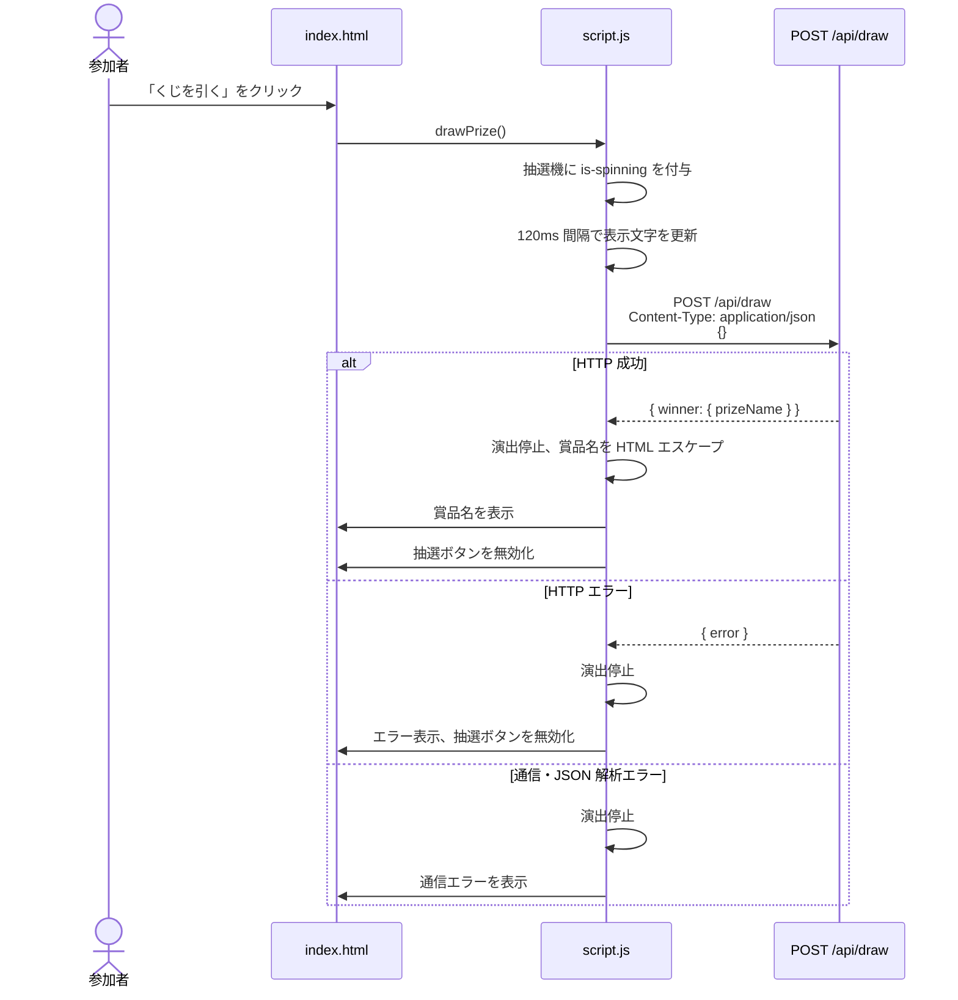
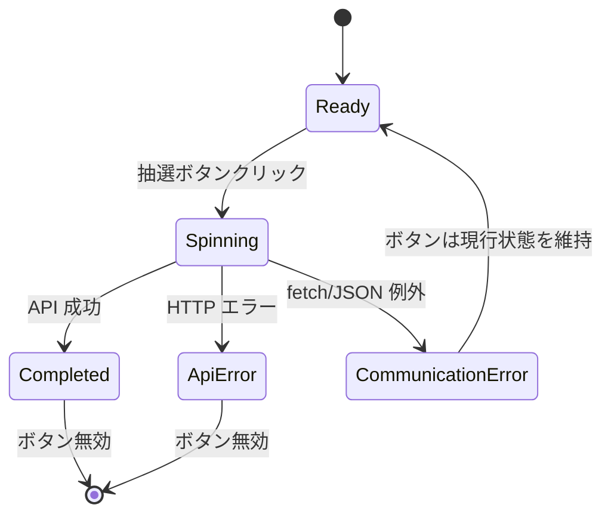
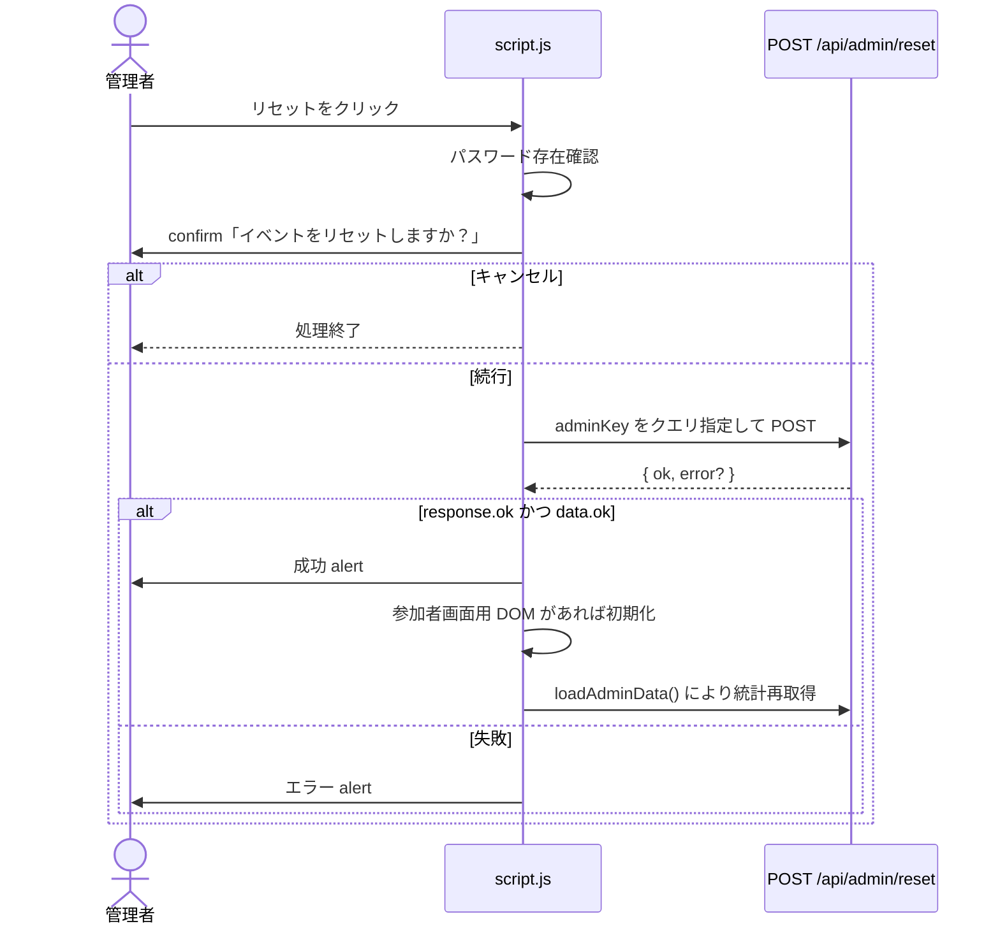

# Lucky Draw 詳細設計書

## 1. 文書情報

| 項目 | 内容 |
|---|---|
| 対象システム | GitHub + Microsoft All Hands 2026 Lucky Draw |
| 作成基準日 | 2026-10-02 |
| 対象 | 現行フロントエンド、API 呼び出し契約、Azure IaC |
| 関連文書 | `docs/basic-design.md` |

## 2. モジュール構成

| ファイル | 責務 | 依存先 |
|---|---|---|
| `site/index.html` | 参加者画面の DOM 定義 | `styles.css`, `script.js` |
| `site/admin.html` | 管理画面の DOM 定義 | `styles.css`, `script.js` |
| `site/script.js` | DOM 制御、抽選演出、API 呼び出し、応答表示 | ブラウザー DOM API、Fetch API、バックエンド API |
| `site/styles.css` | 共通テーマ、抽選機、管理画面、レスポンシブ表示 | HTML の class 名 |
| `infra/main.bicep` | Resource Group 作成、App Service モジュール呼び出し | `app-service.bicep` |
| `infra/app-service.bicep` | App Service Plan と Web App の定義 | Azure Resource Manager |
| `infra/main.bicepparam` | 配備先リージョンとリソース名 | `main.bicep` |

`script.js` は両画面から読み込まれる。各 DOM 要素の有無を確認し、任意連鎖演算子または null チェックによって画面固有処理を分岐する。

## 3. 参加者画面詳細

### 3.1 項目定義

| 項目 ID | DOM ID / class | 種別 | 初期値 | 動作 |
|---|---|---|---|---|
| P-01 | `eventTitle` | 見出し | `All Hands 2026 Lucky Draw` | イベント名を表示する |
| P-02 | `.chip-blue` | ラベル | `1人1回` | 利用ルールを表示する。サーバー側保証ではない |
| P-03 | `prizeDisplay` | 結果表示 | `?` | 演出中の文字または最終賞品名を表示する |
| P-04 | `drawButton` | ボタン | 有効 | クリック時に抽選を開始する |
| P-05 | `resultBox` | 結果メッセージ | 非表示 | 成功結果またはエラーを表示する |
| P-06 | `.admin-link` | リンク | `/admin` | 管理者画面へ遷移する |

### 3.2 抽選処理シーケンス



### 3.3 抽選状態



通信例外時には `drawButton.disabled` を変更しないため、通常は再試行可能である。HTTP エラー時はボタンを無効化する。

## 4. 管理者画面詳細

### 4.1 項目定義

| 項目 ID | DOM ID | 種別 | 初期状態 | 動作 |
|---|---|---|---|---|
| A-01 | `adminPassword` | password input | 空 | 管理者パスワードを入力する |
| A-02 | `loginButton` | button | 有効 | 統計 API を呼び出して認証判定する |
| A-03 | `adminDashboard` | section | 非表示 | 認証成功後に表示する |
| A-04 | `resetButton` | button | ダッシュボード内 | 確認後にイベントをリセットする |
| A-05 | `closeButton` | button | ダッシュボード内 | 確認後に抽選を締め切る |
| A-06 | `exportLink` | link | `#` | 認証成功後に CSV 出力 URL を設定する |
| A-07 | `adminStatus` | text | `-` | `state.status` を表示する |
| A-08 | `adminWins` | text | `0` | `state.winners` 内の `isHit=true` 件数を表示する |
| A-09 | `adminRemaining` | text | `-` | 残り当たり数と当たり上限を表示する |
| A-10 | `winnerTableBody` | tbody | 空 | 抽選結果一覧を生成する |

### 4.2 ログイン・統計表示処理

1. `adminPassword` の前後空白を除去する。
2. 空の場合は「管理者パスワードを入力してください」を alert 表示し、終了する。
3. `GET /api/admin/stats?adminKey=<URL encoded password>` を呼び出す。
4. HTTP ステータスが成功以外、または `data.ok` が false の場合は API エラーまたは「認証に失敗しました」を表示する。
5. 成功時は `adminDashboard` から `hidden` class を除去する。
6. 当たり上限を `state.maxHits`、`state.totalHits`、`60` の優先順で決定する。
7. 残り当たり数を `state.remainingHits`、当たり上限の優先順で決定する。
8. 状態、当選者数、残り当たり数を表示する。
9. CSV 出力リンクへ管理者パスワード付き URL を設定する。
10. `state.winners` が空なら空状態行、1 件以上なら結果行を生成する。

Enter キー押下時も `loadAdminData()` を実行する。

### 4.3 抽選結果一覧

| 列 | 参照値 | 変換 |
|---|---|---|
| No. | `winner.drawNumber` | 変換なし |
| 参加者 | `winner.name` | `escapeHtml()` でエスケープ |
| 結果 | `winner.prizeName` | 未設定時は `isHit` に応じて「当たり」または「ざんねん」。表示前にエスケープ |
| 判定 | `winner.isHit` | true: `当たり`、false: `ざんねん` |

`drawNumber` は現行コードでは HTML エスケープされないため、API は数値のみを返す契約とする。

### 4.4 リセット処理



### 4.5 締め切り処理

1. 管理者パスワードが空の場合は alert を表示して終了する。
2. 「抽選を締め切りますか？」の確認ダイアログを表示する。
3. キャンセル時は終了する。
4. `POST /api/admin/close?adminKey=<URL encoded password>` を呼び出す。
5. 成功時は成功 alert を表示し、統計を再取得する。
6. 失敗時は API エラーまたは「締め切りに失敗しました」を表示する。

リセット処理と締め切り処理には `try/catch` がない。ネットワークエラーまたは JSON 解析エラー時は Promise rejection となり、画面上の明示的なエラー通知は行われない。

## 5. JavaScript 関数設計

| 関数 | 入力 | 出力 | 責務 | 主な副作用 |
|---|---|---|---|---|
| `escapeHtml(value)` | 任意値 | HTML エスケープ済み文字列 | `& < > " '` をエンティティへ変換する | なし |
| `setResult(message, isError=false)` | 表示 HTML、エラーフラグ | なし | 結果領域を表示し、成功・失敗スタイルを切り替える | `resultBox.innerHTML` 更新 |
| `startSpinAnimation()` | なし | なし | 120ms 間隔で仮の抽選結果を巡回表示する | interval 作成、`prizeDisplay` 更新 |
| `stopSpinAnimation(finalText)` | 最終表示文字列 | なし | interval と振動を停止し、260ms 後に結果を表示する | class・style・text 更新 |
| `drawPrize()` | なし | Promise<void> | 抽選 API を呼び出し、演出と結果を制御する | API 呼び出し、DOM 更新 |
| `loadAdminData()` | なし | Promise<void> | 管理者認証を兼ねて統計を取得し、ダッシュボードを更新する | API 呼び出し、alert、DOM 更新 |

### 5.1 グローバル状態

| 変数 | 型 | 初期値 | 用途 |
|---|---|---|---|
| `spinTimer` | interval ID または null | `null` | 抽選演出 interval の重複防止と停止 |
| `SPIN_VALUES` | string[] | 当たり・外れ表示 6 要素 | 抽選中の巡回表示 |

永続的なクライアント状態は保持しない。ページ再読み込み時には抽選済み状態や管理者認証状態を復元しない。

## 6. API 契約

バックエンド実装が存在しないため、以下は `script.js` が要求する最小契約である。

### 6.1 共通

- ベース URL: ブラウザーと同一オリジン
- 文字コード: JSON は UTF-8 を想定
- エラー応答: JSON として解析可能であること
- 管理者認証: 現行クライアントは `adminKey` クエリパラメーターを送信する

### 6.2 API-01 抽選実行

**Request**

```http
POST /api/draw
Content-Type: application/json

{}
```

**成功 Response（クライアント要求形）**

```json
{
  "winner": {
    "prizeName": "当たり"
  }
}
```

**失敗 Response（クライアント要求形）**

```json
{
  "error": "抽選に失敗しました。"
}
```

成功時は `winner.prizeName` が必須である。HTTP エラー時も JSON 応答が必要である。

### 6.3 API-02 管理統計取得

**Request**

```http
GET /api/admin/stats?adminKey={URLエンコード済み管理者パスワード}
```

**成功 Response（クライアント要求形）**

```json
{
  "ok": true,
  "state": {
    "status": "open",
    "maxHits": 60,
    "remainingHits": 42,
    "winners": [
      {
        "drawNumber": 1,
        "name": "参加者名",
        "prizeName": "当たり",
        "isHit": true
      }
    ]
  }
}
```

| パス | 型 | 必須 | 備考 |
|---|---|---|---|
| `ok` | boolean | 必須 | true の場合のみ認証成功として扱う |
| `state` | object | 成功時必須 | イベント状態 |
| `state.status` | string | 必須 | 画面へそのまま表示 |
| `state.maxHits` | number | 任意 | 未設定時は `totalHits`、さらに未設定なら 60 |
| `state.totalHits` | number | 任意 | `maxHits` の互換項目 |
| `state.remainingHits` | number | 任意 | 未設定時は当たり上限 |
| `state.winners` | array | 必須 | 当選者数計算と一覧生成に使用 |
| `winners[].drawNumber` | number | 必須 | 抽選番号 |
| `winners[].name` | string | 必須 | 参加者名 |
| `winners[].prizeName` | string | 任意 | 未設定時は当落から表示を補完 |
| `winners[].isHit` | boolean | 必須 | 当選者数と判定表示に使用 |

**失敗 Response**

```json
{
  "ok": false,
  "error": "認証に失敗しました"
}
```

### 6.4 API-03 イベントリセット

```http
POST /api/admin/reset?adminKey={URLエンコード済み管理者パスワード}
```

成功応答:

```json
{ "ok": true }
```

失敗応答:

```json
{ "ok": false, "error": "リセットに失敗しました" }
```

### 6.5 API-04 抽選締め切り

```http
POST /api/admin/close?adminKey={URLエンコード済み管理者パスワード}
```

成功応答:

```json
{ "ok": true }
```

失敗応答:

```json
{ "ok": false, "error": "締め切りに失敗しました" }
```

### 6.6 API-05 CSV 出力

```http
GET /api/admin/export?adminKey={URLエンコード済み管理者パスワード}
```

レスポンス本文の列構成は現行コードから特定できない。ブラウザーによるダウンロードを想定し、バックエンドでは少なくとも適切な `Content-Type` と `Content-Disposition` を返す必要がある。

## 7. 表示・スタイル設計

### 7.1 テーマ

- 背景: 濃紺のグラデーション
- パネル: 半透明の濃色カード
- 主操作: オレンジから赤のグラデーション
- 成功表示: 緑系
- エラー表示: 赤系
- 抽選機: 木目色、金属色、ガラス風表示

色は `:root` の CSS カスタムプロパティで管理する。

### 7.2 抽選演出

| 演出 | 実装 |
|---|---|
| 抽選機振動 | `.machine.is-spinning` に `raffleShake` を 0.38 秒間隔で無限適用 |
| 表示巡回 | 120ms 間隔で `SPIN_VALUES` を順次表示 |
| 結果確定 | 260ms 後に最終文字を設定 |
| 結果強調 | `scale(1.08)` から `scale(1)` へ遷移 |

### 7.3 レスポンシブ

ブレークポイントは 640 px とする。

- ヘッダーを横並びから縦並びへ変更する。
- ヘッダー操作領域を左寄せにする。
- 抽選機と表示ガラスの最大幅を縮小する。
- 賞品名の文字間隔を縮小する。
- 統計グリッドを 3 列から 1 列へ変更する。

## 8. エラー処理設計

| 処理 | 条件 | 表示 | 再試行 |
|---|---|---|---|
| 抽選 | HTTP エラー | API `error` または「抽選に失敗しました。」 | ボタン無効のため同一画面では不可 |
| 抽選 | 通信・解析例外 | 「通信エラーが発生しました。時間をおいて再度お試しください。」 | 通常は可能 |
| 統計取得 | パスワード未入力 | alert | 入力後に可能 |
| 統計取得 | 認証・HTTP エラー | API `error` または「認証に失敗しました」 | 可能 |
| 統計取得 | 通信・解析例外 | 「管理者データの取得に失敗しました。」 | 可能 |
| リセット | パスワード未入力 | alert | 入力後に可能 |
| リセット | API の論理・HTTP エラー | API `error` または固定文言 | 可能 |
| リセット | 通信・解析例外 | 現行実装では明示表示なし | ブラウザー状態による |
| 締め切り | パスワード未入力 | alert | 入力後に可能 |
| 締め切り | API の論理・HTTP エラー | API `error` または固定文言 | 可能 |
| 締め切り | 通信・解析例外 | 現行実装では明示表示なし | ブラウザー状態による |

## 9. セキュリティ詳細

| 項目 | 現行設計 | 詳細設計上の注意 |
|---|---|---|
| 通信暗号化 | App Service で HTTPS 必須 | API も同一オリジン HTTPS とする |
| 管理者認証情報 | `adminKey` を URL に付与 | ログ・履歴への漏えいを防ぐため、本番化時は POST + セッションへ変更する |
| HTML エスケープ | 賞品名、参加者名、一覧の賞品名に適用 | API エラーは `innerHTML` 経由のため text 表示へ変更が必要 |
| 重複抽選 | クライアントのボタン無効化 | サーバーで認証済み参加者単位に原子的に制御する |
| 管理操作 | confirm のみ | API 側で認証・認可・CSRF 対策を実装する |
| CSV | バックエンド不在 | CSV Formula Injection と改行・引用符を無害化する |
| FTPS | 無効 | 維持する |
| TLS | 1.2 以上 | 維持する |

## 10. インフラ詳細

### 10.1 `main.bicep`

| 定義 | 値 |
|---|---|
| デプロイスコープ | subscription |
| `location` 既定値 | `australiaeast` |
| `resourceGroupName` 既定値 | `lottery` |
| `appServiceName` 既定値 | `lottery-maishid-20261002` |
| Resource Group API version | `2025-04-01` |
| モジュール名 | `app-service` |
| 出力 | Resource Group 名、App Service 名、既定ホスト名 |

### 10.2 `app-service.bicep`

| リソース | 設定 | 値 |
|---|---|---|
| App Service Plan | kind | `linux` |
| App Service Plan | SKU | Free F1 |
| App Service Plan | capacity | 1 |
| App Service Plan | reserved | true |
| Web App | kind | `app,linux` |
| Web App | HTTPS only | true |
| Web App | public network access | Enabled |
| Web App | runtime | `NODE|22-lts` |
| Web App | startup command | `pm2 serve /home/site/wwwroot --no-daemon` |
| Web App | always on | false |
| Web App | FTPS | Disabled |
| Web App | minimum TLS | 1.2 |
| Web App | SCM minimum TLS | 1.2 |
| Web App | HTTP/2 | enabled |

### 10.3 配備物

ZIP アーカイブ直下へ次のファイルを配置する。

```text
index.html
admin.html
script.js
styles.css
```

現行 Bicep はバックエンドプロセス、データベース、ストレージ、Key Vault、Application Insights、ルーティングリライトを作成しない。

## 11. 実装差分・要確認事項

| ID | 内容 | 優先度 | 完了条件 |
|---|---|---|---|
| GAP-01 | バックエンド API がリポジトリに存在しない | 必須 | API-01～API-05 の実装と統合試験が完了する |
| GAP-02 | 永続化方式が未特定 | 必須 | スキーマ、排他制御、復旧、保持期間が定義される |
| GAP-03 | 参加者の識別と 1 人 1 回の保証が未定義 | 必須 | 信頼できる ID と原子的な重複防止を実装する |
| GAP-04 | 管理者パスワードを URL で送信する | 必須 | URL から認証情報を除去する |
| GAP-05 | API エラーを `innerHTML` で表示する | 高 | 外部入力を text として表示する |
| GAP-06 | リセット・締め切りの通信例外を通知しない | 高 | 例外時に管理者へ明示的なエラーを表示する |
| GAP-07 | `/admin` の静的ルーティングが未定義 | 高 | App Service 上で `/admin` が管理画面を返すことを確認または設定する |
| GAP-08 | 添付図に CSV 出力 API がない | 中 | API-05 をバックエンド設計へ反映する |
| GAP-09 | `drawNumber` が未エスケープ | 中 | 数値スキーマをサーバーで保証するか安全に出力する |
| GAP-10 | 監視・ログ・アラート定義がない | 中 | 運用要件に応じて監視設計を追加する |

## 12. テスト観点

| 区分 | 観点 |
|---|---|
| 参加者画面 | 初期表示、抽選成功、HTTP エラー、通信エラー、二重クリック、長い賞品名 |
| 管理画面 | 未入力、認証失敗、認証成功、空一覧、複数結果、互換項目 `totalHits` |
| 管理操作 | confirm の OK/Cancel、成功、HTTP エラー、通信エラー |
| 表示安全性 | 名前・賞品名・API エラーに HTML 特殊文字を含む場合 |
| レスポンシブ | 640 px 境界の前後、表の横スクロール |
| API 契約 | 必須項目欠落、不正型、不正 JSON、非 JSON エラー |
| 配備 | `/`, `/admin`, `/admin.html`, `/script.js`, `/styles.css` の応答 |
| セキュリティ | HTTPS 強制、TLS、管理者認証情報のログ、CSRF、重複抽選、CSV Formula Injection |

## 13. ソース対応表

| 詳細設計 | 実装箇所 |
|---|---|
| 参加者 DOM | `site/index.html` |
| 管理者 DOM | `site/admin.html` |
| `escapeHtml`, `setResult` | `site/script.js` 14～31 行 |
| 抽選演出 | `site/script.js` 33～68 行 |
| 抽選 API | `site/script.js` 71～133 行 |
| 管理統計 API | `site/script.js` 135～181 行 |
| リセット API | `site/script.js` 183～208 行 |
| 締め切り API | `site/script.js` 210～230 行 |
| 共通スタイル | `site/styles.css` |
| Azure サブスクリプション構成 | `infra/main.bicep` |
| App Service 構成 | `infra/app-service.bicep` |

